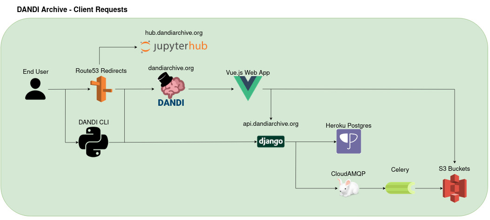
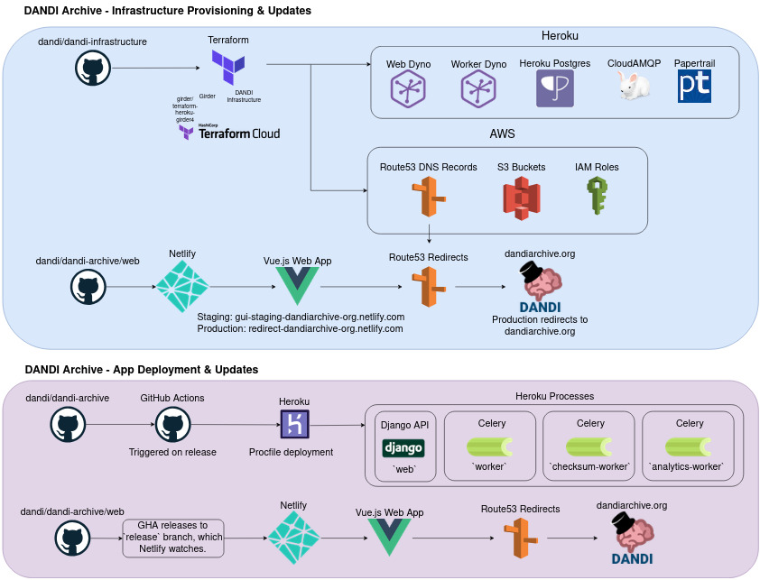

# System Architecture

This page provides a high-level view of how DANDI's core components fit together in a typical "full stack" deployment.

## The Big Picture

The DANDI platform is essentially composed of:

1. **Storage**: S3 buckets (AWS) where data actually resides.
2. **API**: A Django/Resonant-based backend application (hosted on Heroku) that handles the DANDI data model, user authentication, and orchestrates S3 interactions.
3. **Frontend**: A Vue-based web application (hosted on Netlify) for users to browse, search, and manage data in the archive.
4. **Workers**: Celery workers (also on Heroku) for asynchronous tasks such as file checksum calculations, analytics, and housekeeping.
5. **Observability**: Log aggregation and alerting (Heroku logs), plus Sentry for error-tracking and notifications.
6. **Infrastructure-As-Code**: Terraform scripts that glue everything together—AWS (S3, Route53, etc), Netlify, Heroku, etc.

These services interconnect as follows:

* The user (or script) interacts with the **Web UI** or the **DANDI CLI**.
* The **Web UI** calls into the **API** (over HTTPS).
* The **API** queries or updates metadata in its Postgres DB (hosted on Heroku).
* The **API** calls AWS S3 to read/write DANDI assets.
* Certain heavy-lift or background tasks get queued into Celery tasks, handled by the **Workers**.
* Domain names, certificates, and load-balancing records are handled by AWS Route 53 or Netlify's DNS, depending on whether it's the API subdomain or the apex domain for the UI.
* Large chunks of data can be streamed from S3 directly to the Client via presigned URLs.

## Key Components

### 1. AWS S3 Storage

* **Primary Storage**: S3 buckets are the primary storage of the data (Zarr, NWB, etc.).
* **Configured via terraform**: Bucket creation, IAM policies, route to logs, etc., are specified in `terraform/*.tf`.

### 2. Heroku

Provisions the servers, worker processes, and the database for the API.

1. **API**: Django, extended by [Resonant](https://github.com/kitware-resonant/terraform-heroku-resonant), provides REST endpoints for metadata, asset management, versioning, and authentication.
2. **Postgres**: Stores user metadata, dandiset metadata, and references to S3 objects.
3. **Workers (Celery)**: Offload long-running tasks (checksums, analytics, zarr validation, etc.).

### 3. Netlify (UI)

* **Frontend server**: Serves a static build of the DANDI Archive frontend (Vue.js).
* **Autodeployment**: On each push or merge to `main` (or whichever branch is configured), Netlify automatically builds and deploys.
* **Configuration**:
  - **`netlify.toml`**: Describes build commands, environment variables for staging vs. production.
  - **`.env.production`**: Holds the environment variables for the Vue-based app at runtime (e.g. `VITE_API_URL`, `VITE_SENTRY_DSN`).

### 4. Terraform Infrastructure

The single source of truth for spinning up or tearing down resources such as S3 buckets, IAM users, Route 53 DNS, Heroku pipeline config, Netlify domain config, etc.

* **Repo**: The [`dandi-infrastructure`](https://github.com/dandi/dandi-infrastructure) repo.
* **Terraform Cloud**: Used to plan or apply changes after you push commits to the infrastructure repo.
